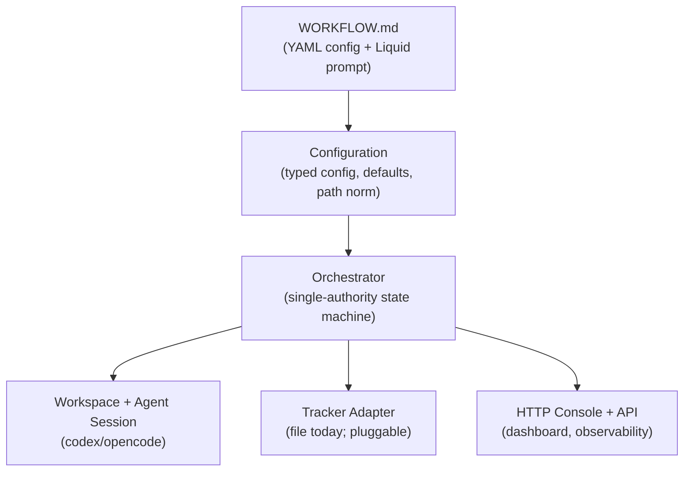

# Symphony


## Why Symphony?

Symphony turns an issue tracker into a queue of work. Autonomous coding agents pull issues, work them, and report results back to the tracker. The system manages its own backlog with no external tools needed.

## What It Does

Symphony reads work continuously from a configured issue tracker. It creates an isolated workspace for each issue. A coding agent session runs inside that workspace. This implementation follows [`SPEC.md`](./SPEC.md) (Symphony Service Specification, Draft v1).

Symphony reads trackers and runs agents. Agents write ticket updates through host-side tools. The orchestrator never edits tickets itself.

## Quick Start

### Requirements

- **Node.js ≥ 22.6** (24+ recommended)
- TypeScript runs directly — no build step
- **Codex** CLI authenticated (`codex app-server` must work)

### Install and Run

```bash
npm install
npm start                 # runs ./WORKFLOW.md
# or
node src/index.ts ./WORKFLOW.md --port 7878
```

Open <http://127.0.0.1:7878> to see the live console.

### Test and Type-Check

```bash
npm test        # node --test test/
npm run typecheck
```

### Docker

A `Dockerfile` and `docker-compose.yml` are included for a one-command
containerized deploy. The image is `node:24-slim` + the source tree + production
deps (no build step), runs as a non-root user, and exposes the console on
`8420`. `docker compose up` brings it up with the file tracker; state (per-issue
workspaces) persists in a named volume, and `issues/` +
`WORKFLOW.md` are bind-mounted from the host so you can edit them without a
rebuild:

```bash
docker compose up          # console on http://localhost:8420
docker compose restart     # state survives restart
```

The HTTP server binds loopback by default. To expose the console (the container
needs this), set `SYMPHONY_HOST=0.0.0.0` — either via the env var or the `--host`
flag. The compose file sets it for you.

**Agent CLIs are not in the image.** Symphony orchestrates external `codex` /
`opencode` binaries, which are intentionally not bundled. To run real agents in a
container, either:

- **Mount** the CLIs (and their config dirs) from the host, e.g. extend the
  `volumes:` in `docker-compose.yml` to bind `/usr/local/bin/codex` and the
  `~/.codex` / `~/.config/opencode` directories into the container, or
- **Extend** the image with a downstream `FROM symphony:local` stage that installs
  the CLIs.

Without the CLIs, the container still serves the console and the file tracker,
but issuing an active-state issue will fail its dispatch preflight with a missing
agent error. CI builds the image (`docker build .`) but does not run agents.

## The Console

The web UI shows a **Board** of issues grouped by state (backlog, active, done). Completed work stays visible.

You see:
- Live running agent sessions
- A detail drawer per issue
- Buttons: **＋ New issue**, **Start** / **Hold** / **Reopen**, **Stop**, **Poll now**

### Retries

A failed run retries with exponential backoff. Retries stop after `agent.max_retry_attempts` (default 3; `0` = unlimited). Press **Stop** to end a running session or cancel a pending retry. A stopped issue is held — it does not re-dispatch until you change its state (**Hold** or **Retry**). **Hold** on a running issue stops the session and parks it in the backlog.

Click any issue to open its detail drawer. It shows a timestamped **activity log**. The log includes agent messages, shell commands, file edits, and turn lifecycle. Logs stream while a run is active. They are kept after the run finishes.

Get the same log via `GET /api/v1/<identifier>` → `recent_events`.

### Starting Work

New issues land in the `backlog` state. They do not run until you move them to `todo`. Click **Start** or use `POST /api/v1/issues/<id>/state {"state":"todo"}`.

### Follow-ups (Same Branch)

Review comes back on a delivered branch. Filing the fixes as a new issue would open a
second branch off the base, leaving you to reconcile the two later. Press **↳ Follow-up**
on the issue instead: the new issue joins the same *work stream*, so it reuses that
workspace and commits onto the same branch, on top of what is already there. Its delivery
covers the whole branch, not just the fixes.

Follow-ups of follow-ups still name the original branch. Issues in one stream run one at a
time — they share a worktree — while unrelated issues keep running in parallel.

### HTTP API Routes

All issue routes are scoped by project id: `/api/v1/projects/<pid>/…`. A single-workflow host has one project named `default`.

| Endpoint | Method | Purpose |
|----------|--------|---------|
| `/api/v1/projects` | GET / POST | List projects / add a project |
| `/api/v1/projects/<pid>/state` | GET | Get full state |
| `/api/v1/projects/<pid>/issues` | GET | Get all issues (board) |
| `/api/v1/projects/<pid>/issues` | POST | Create issue: `{ "identifier": "SYM-3", "title": "...", "state": "backlog" }` |
| `/api/v1/projects/<pid>/issues/<id>` | PATCH | Edit issue: any of `{ "title", "description", "priority", "labels" }` |
| `/api/v1/projects/<pid>/issues/<id>` | DELETE | Delete issue and its workspace (409 while it is running or retrying — stop it first) |
| `/api/v1/projects/<pid>/issues/<id>/follow-up` | POST | Create an issue that continues this one on the **same branch** (review fixes); same body as create |
| `/api/v1/projects/<pid>/issues/<id>/state` | POST | Change state: `{"state":"todo"}` |
| `/api/v1/projects/<pid>/issues/<id>/stop` | POST | Stop a running session or pending retry; hold the issue for a manual state change |
| `/api/v1/projects/<pid>/refresh` | POST | Poll now |

Hand-editing JSON files in `issues/` also works.

## It Tracks Itself

The default `WORKFLOW.md` uses the **file tracker** (`tracker.kind: file`). Issues live as JSON files in [`./issues`](./issues).

Symphony reads those issues. It runs Codex to work each issue in an isolated workspace. The agent reports its outcome back to the same store. No external tracker or credentials needed. Symphony manages its own backlog.

### How an Issue Flows Through the System

1. The runner writes the issue into the workspace as `SYMPHONY_ISSUE.json`
2. The agent works in the workspace
3. The agent writes `SYMPHONY_RESULT.json`: `{ "state": "...", "comment": "...", "pr_url": null }`
4. After each turn, the runner applies the result via the adapter's `set_issue_result` tool
5. The runner re-checks state to decide whether to continue
6. A terminal state ends the run and cleans up the workspace

The file adapter provides agent tools. These run **host-side**: `update_issue_state`, `add_issue_comment`, `set_issue_result`. When Codex calls them, they directly update the issue store.

## Architecture

Symphony layers cleanly. Each layer is independently portable (SPEC §3.2).



The layers map to source code:

| Layer | Code | Purpose |
|-------|------|---------|
| Policy | `WORKFLOW.md` | YAML front matter + Liquid prompt body |
| Configuration | `src/config/config.ts` | Typed getters, defaults, variable expansion, path normalization |
| Coordination | `src/orchestrator/*` | Single-authority state machine |
| Execution | `src/workspace/*`, `src/agent/*` | Workspaces and agent sessions |
| Integration | `src/tracker/*` | Tracker adapters and agent tools |
| Observability | `src/logger.ts`, `src/server/*` | Structured logs, HTTP dashboard, API |

### Adding Your Own Agent

The Execution layer uses only the `AgentSession` interface (`src/agent/types.ts`). Codex is one backend (`src/agent/appServerClient.ts`), selected by `agent.kind: codex`.

To add another agent:

1. Implement `AgentSession` and `AgentFactory` (lifecycle: `start` → `runTurn`* → `stop`)
2. Register it: `registerAgentFactory(factory)` in `src/agent/registry.ts`
3. Select it in `WORKFLOW.md`: `agent.kind: <your-kind>`

No orchestrator, runner, workspace, or tracker code changes. The system is agent-neutral.

### Adding Your Own Tracker

Adapters implement `TrackerAdapter` (`src/tracker/types.ts`). Register them by kind in `src/tracker/registry.ts`.

Add a new tracker (Linear, GitHub Projects, Jira, etc.) by:
1. Mapping provider payloads to the normalized `Issue` schema
2. Deriving the `dispatchable` field
3. Registering the adapter with a kind name

No orchestrator changes needed. The system is tracker-agnostic.

### Integration Checklist

See [INTEGRATION.md](INTEGRATION.md) for the full walkthrough. It covers files to change, the event vocabulary, and testing. The console's **⚙ Integrate** button lists registered backends and the checklist.

## Trust & Safety Posture

**This is designed for trusted environments.** Symphony runs Codex in a high-trust configuration (SPEC §15.1).

### Default Configuration (High Trust)

- `codex.approval_policy: never`
- `codex.thread_sandbox: danger-full-access` or `codex.turn_sandbox_policy: { type: dangerFullAccess }`
- No approval round-trips
- The agent runs commands and edits files in its workspace unattended
- User-input-required turns cause hard failure (the run does not stall)
- Unsupported tool calls return structured failure (session continues)

### Always-Enforced Baseline Controls (SPEC §9.5, §15.2)

- Agent cwd is always the per-issue workspace path
- Workspace paths are sanitized: `[A-Za-z0-9._-]` with collision-resistant hash suffix
- Paths are validated to stay inside the configured workspace root

### Hardening Steps (SPEC §15.5)

To strengthen security:
- Tighten `approval_policy` and `sandbox` in `WORKFLOW.md`
- Run under a dedicated OS user on a dedicated volume
- Restrict eligible issues by state, labels, or `dispatchable` flag

## File Tracker Adapter Profile

Reference: SPEC §11.2.

### Configuration

| Setting | Value | Notes |
|---------|-------|-------|
| `tracker.kind` | `file` | Required |
| `tracker.provider.dir` | `./issues` (default) | Path to issues directory; relative to `WORKFLOW.md`; supports `~` and `$VAR` |
| Secret keys | None | `secret_environment_names()` returns `[]` |

### How Issues Are Read

- Every `*.json` file directly under `dir` is one issue
- No paging limit
- Files are read in sorted order

### Field Mapping and Normalization

**Mapping**:
- `id` defaults to `identifier` if absent
- `native_ref` preserved verbatim if it is a JSON object; otherwise set to `null`

**Required fields** (non-empty strings):
- `id`, `identifier`, `title`, `state`

**Processing**:
- `labels`: trimmed, lowercased, deduplicated
- `priority`: integer 1–4 or null (lower number = higher priority)
- `dispatchable`: from file (default `true`)
- `follow_up_for` / `stream_identifier`: carried as-is (see Follow-ups); absent = the issue
  leads its own stream
- Timestamps: pass through as strings or null

### Malformed Records

A malformed record has missing/blank required fields or unreadable/invalid JSON.

- **State-list reads**: log the error and omit the malformed record
- **ID-refresh**: fail with `tracker_response` error if requested record is malformed
- **Empty lists**: return `[]` with no file read attempt

### Agent Tools

These tools mutate tracker state (execute host-side):

| Tool | Input | Notes |
|------|-------|-------|
| `update_issue_state` | `{state, comment?}` | Update state and optional comment |
| `add_issue_comment` | `{comment}` | Add comment only |
| `set_issue_result` | `{state?, comment?, pr_url?}` | Set result fields |

Unknown tool names return structured failure. Results: `{success, output}` (JSON-safe).

### Error Categories

Errors are `AdapterError{category, message}`:
- `invalid_tracker_config`: Configuration error
- `unsupported_tracker_kind`: Unknown tracker kind
- `tracker_request`: Request error (e.g., bad parameter)
- `tracker_response`: Response error (e.g., malformed data)

## Configuration Reference

All fields, defaults, and semantics live in SPEC §6.4.

**WORKFLOW.md front matter keys**:
- `tracker`: Which tracker adapter to use
- `polling`: Poll interval and backoff strategy
- `workspace`: Workspace directory and structure
- `hooks`: Lifecycle hooks (before/after actions)
- `agent`: Which agent backend to use
- `codex`: Codex-specific settings (approval, sandbox)
- `server`: HTTP server settings (extension)

Set `agent.kind` to select the agent backend (default: `codex`).

**Reloading**: `WORKFLOW.md` is watched and hot-reloaded. Invalid reloads keep the last-good config and log an error to the operator.

## Testing and Conformance

`npm test` covers the Core Conformance matrix (SPEC §17):
- Workflow and config parsing and reloading
- Strict prompt rendering (no variable injection)
- Workspace sanitization, containment, and hooks
- Tracker normalization, malformed handling, agent tools
- Orchestrator dispatch, continuation, backoff, retry

The test suite uses a fake agent backend. The Codex app-server client is exercised by integration tests described in the "It Tracks Itself" section.
