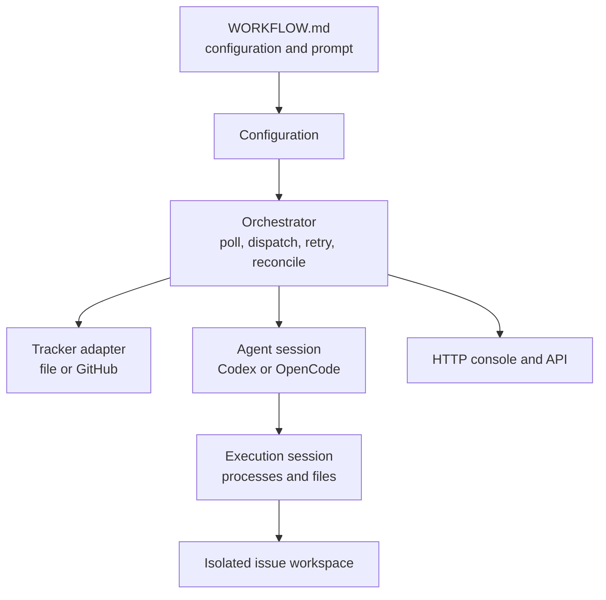

# Architecture

Symphony separates policy, coordination, execution, integrations, and observability so
agent and tracker backends can change without altering the orchestration loop.

| Layer | Location | Responsibility |
|---|---|---|
| Policy | `WORKFLOW.md` | Tracker, workspace, agent, polling, and Liquid prompt |
| Configuration | `src/config`, `src/workflow` | Validation, defaults, path resolution, hot reload |
| Coordination | `src/orchestrator` | Dispatch, concurrency, continuation, retries, reconciliation |
| Execution | `src/workspace`, `src/agent`, `src/execution` | Host workspaces, agent protocols, and runtime processes/files |
| Integration | `src/tracker` | Issue normalization and host-side tracker tools |
| Observability | `src/history`, `src/server` | Activity history, costs, console, and HTTP API |
| Multi-project host | `src/project` | Independent orchestrators loaded from a project manifest |

## Execution flow

1. The tracker returns normalized, dispatchable issues in an active state.
2. The orchestrator reserves capacity and prepares an isolated workspace.
3. The runner creates the selected execution session, runs `before_run`, writes issue
   context, and starts the configured agent through that session. Protocol paths refer to
   the runtime workspace; host delivery paths remain with the workspace manager.
4. Agent updates feed the activity log, usage counters, and stall detection.
5. Host-side tracker tools keep credentials on the host. Remote agents queue results;
   their tracker mutations wait for a verified checkpoint.
6. Symphony re-reads the issue after a turn and either continues, retries, or finalizes
   the run.
7. The runner awaits agent termination and runs `after_run`. Remote attempts then save
   and verify a host checkpoint before applying their result and closing the runtime.
   Export failure retains the runtime and halts the issue for recovery.
   Shutdown waits for this cleanup, and cancellation also covers pending runtime creation
   and `before_run` hooks.

Repository-backed projects use git worktrees and preserve their delivery branches.
Scratch projects use ordinary per-issue directories. Follow-up issues share the original
work stream so review fixes land on the same branch.

[Checkpoint journals](checkpoints.md) preserve pending imports and tracker handoffs
outside disposable workspaces. Failed-turn archives remain separate from the successful
checkpoint used for retries.

See [`SPEC.md`](../SPEC.md) for the complete behavioral contract and
[`INTEGRATION.md`](../INTEGRATION.md) for extension interfaces and tests.
